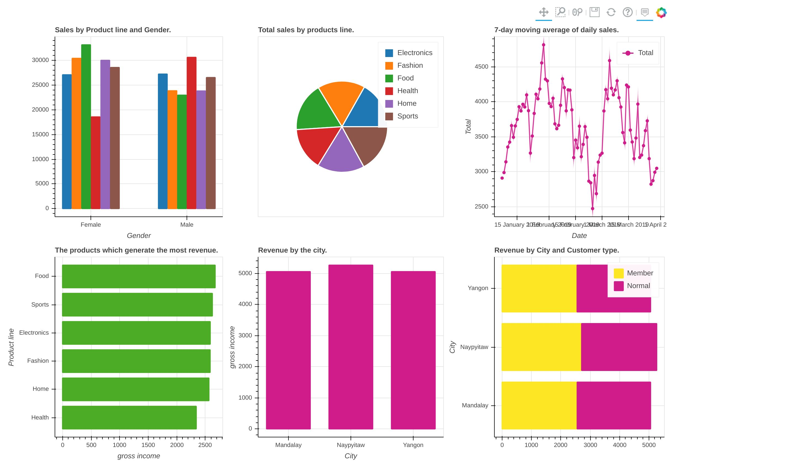

# Sales Dashboard

## Interactive Sales Dashboard using Bokeh and Pandas

### General info 
The project allows to build interactive dashboard from sales data by using pandas-bokeh library. First I have build some functions based on sales data analysis used for visualization of charts. Then I have used bokeh library to build dashboard. 

### Dataset
The dataset comes from Kaggle (Supermarket Sales) and can be find [here](https://www.kaggle.com/datasets/aungpyaeap/supermarket-sales). 

### Project includes:
- sales dashboard with bokeh - **bokeh_dashboard.ipynb**
- final sales dashboard in html format - **sales_dashboard.html**
- python script to make dashboard with bokeh - **bokeh_script.py**

### Technologies

Project is created with:
- Python 3.6,
- libraries: pandas, pandas-bokeh, bokeh.

**Running the project:**

To run this project use Jupyter Notebook or Google Colab.

### Sales dashboard view:

